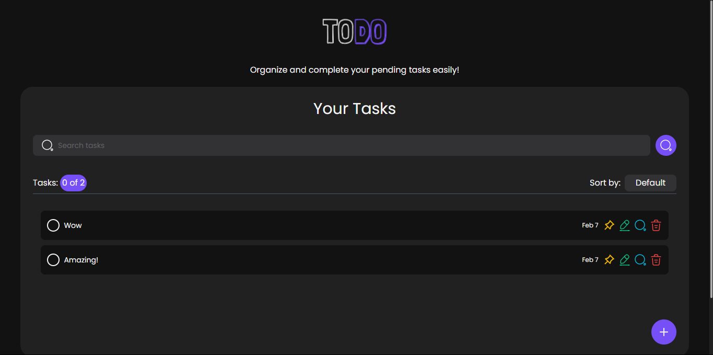

# Todo Project

This is a Todo Project made with React, TypeScript, Vite, TailwindCSS, and SCSS for the frontend, and ExpressJS, MongoDB, and TypeScript for the backend.



## Project Structure

- `Todo Back/`: Contains the backend code.
  - See the [README](Todo%20Back/README.md) for more details.
- `Todo Front/`: Contains the frontend code.
  - See the [README](Todo%20Front/README.md) for more details.

## Installation

1. Clone the repository.
2. Navigate to the `Todo Back` directory and run `npm install` to install the backend dependencies.
3. Navigate to the `Todo Front` directory and run `npm install` to install the frontend dependencies.
4. Create a `.env` file in the `Todo Back` directory as described in the backend [README](Todo%20Back/README.md).

## Running the Project

1. Start the backend server:
   ```sh
   cd ".\Todo Back"
   npm run dev
   ```
2. Start the frontend development server:
   ```sh
   cd ".\Todo Front"
   npm run dev
   ```

## Author

MOJTABA5858

## My Social Media

- **[Work GitHub Page](https://github.com/dev-mojtaba/)**
- **[Private GitHub Page](https://github.com/mojtaba5858/)**
- **[YouTube (Private & Work Both)](https://www.youtube.com/@MOJTABA5858/)**
- **[Instagram](http://instagram.com/dev_mojtaba)**
- **[LinkedIn](https://linkedin.com/in/mojtaba-zebardast-267010297/)**

### License

[LICENSE](LICENSE)
